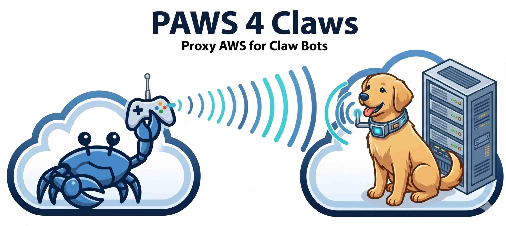

# paws4claws — Proxied AWS CLI

A credential-isolation daemon for AI agent containers. Agents run **AWS CLI**
(`aws`) commands without ever holding credentials — not boto3, not the AWS SDKs for
Python/JS/Go, or any other programmatic client. A dedicated sidecar container holds
credentials, runs the real `aws` CLI, and returns the result. The agent can pipe
output through `jq`, `grep`, etc. before it ever reaches the LLM.

## Problem

AI agent containers cannot safely hold long-lived AWS credentials:

- Credentials in the container mean credentials in the LLM's reachable environment
- Why not MCP? Raw AWS output is often too large to pass to the LLM unfiltered
- [OneCLI](https://github.com/onecli/onecli) proxies HTTP APIs but the `aws` protocol works with fully signed payload

## How it works

The PAWS daemon runs in its own container on a dedicated Docker network. Agent
containers that need AWS access are added to that network. Inside each agent
container, a drop-in shell script named `aws` replaces (or precedes) the real
binary. The agent uses it exactly as it would the real CLI:

```
agent calls:  aws s3 ls s3://bucket/ | grep ".csv"
                    │
              /usr/local/bin/aws  (wrapper script — curl + jq, no credentials)
                    │  POST /invoke  {"args": ["s3", "ls", "s3://bucket/"]}
                    │  Authorization: Bearer <token>
                    ▼
              paws daemon container  (holds AWS credentials, runs aws CLI)
                    │  {"exitCode": 0, "stdout": "...", "stderr": "..."}
                    ▼
              wrapper writes stdout/stderr, exits with exitCode
                    │
              grep ".csv"   ← runs locally, only matches reach LLM context
```

The agent never has `AWS_ACCESS_KEY_ID`, `AWS_SECRET_ACCESS_KEY`, or any token.
Each agent container gets its own bearer token; all tokens map to the same IAM
credentials in the first version, I might consider adding more in the future, but
a true paranoid DevOps guy like me would rather run two containers with different credentials
for each.

The paws container can get the dredentials from IMDSv2, ~/.aws/ files or the
environment, as it runs the real `aws` CLI v2.

**Scope:** PAWS intercepts the `aws` shell command via a wrapper script. Python code
using boto3 (or `@aws-sdk/*`, etc.) talks to AWS APIs directly and is out of scope —
use IAM-scoped credentials in those processes separately, or shell out to `aws` if
PAWS isolation is required.

## Roadmap

| Version | Feature                                                                     |
| ------- | --------------------------------------------------------------------------- |
| **v1**  | argv forwarding, stdout/stderr return, per-client tokens, service allowlist |
| **v2**  | stdin passthrough (`echo data \| aws s3 cp - s3://bucket/key`) — **done**   |
| **v3**  | file passing (wrapper detects local file args, inlines them in the request) |
| future  | multiple IAM profiles mapped to tokens, streaming output                    |

## Security model

- **Credentials never in the agent container.** The daemon holds them; agents
  communicate only over HTTP with a bearer token.
- **Network isolation.** The daemon binds only to the `paws-net` Docker bridge.
  Containers not joined to that network cannot reach it.
- **Per-client bearer tokens.** Each agent container gets a unique random token.
  A daemon with no tokens configured rejects everything.
- **Argv sanitization.** Every argument is validated against a strict character
  allowlist before exec. `shell=False` — the shell never sees the args.
- **Service allowlist.** Only explicitly permitted AWS services can be invoked.
- **IAM is the primary security control.** The allowlist is defense-in-depth.
  Scope the IAM credentials to exactly what the agents need.

*Disclaimer:* this is not (yet) a stable or commercial-level product. It was written to scratch my personal itch.
I would appreciate more experienced eyes to check my design and code and offer improvements.

## Installation

See [INSTALL.md](INSTALL.md) for full setup instructions: building the image,
creating the Docker network, generating tokens, running the daemon, and wiring
agent containers in.

## Agent integrations

Each clawed agent works differently. I use NanoClaw, you may use Hermes, OpenClaw or one of the many others on the market.
Claw agents are often in flux, additions like PAWS will be implemented by a Claude skill usually, rather than a deterministic piece of code.
In the spirit of the \*claw world, I am including a [sample nanoclaw skill](examples/nanoclaw/paws-aws.md), and you're welcome to add your improvements and ports to other claws with a PR.

## See also

- [INSTALL.md](INSTALL.md) — setup, docker-compose, agent wiring
- [DESIGN.md](DESIGN.md) — full architecture, wire protocol, sanitization rules
